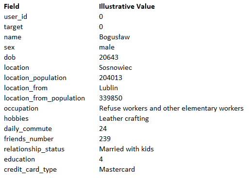

Classification Modeling of gym interest
-------------------
* Notebook containing the full analysis and machine learning modeling of a gym chain business problem.
* The international gym chain intends to open new venues in Poland. To identify the best possible locations and
  target customers they have purchased and collected basic socio-demographic data on 4000 people.
* The target of the modeling was to predict whether any given person will be interested in purchasing a gym
  membership or not.
* The collected data consisted of two sets, one structured in a csv file and one unstructured in a JSON file.
  
* The structured data contained the following information:

* The unstructured data looked as follows:

* In the first step I performed data cleaning (mostly dealing with missing values, and I transformed the unstructured 
  data into a more usable form.
* Next, using the clean dataset I proceeded to engineer new features that could prove helpful with predictions.
* In the following step, I conducted the Exploratory Data Analysis to gain insight into the dataset, identify trends
  and select only the features that can help the ML model to avoid overfitting.
* In my approach to modelling I first tested multiple models with their default parameters:
    * Logistic Regression
    * AdaBoost Classifier
    * Gradient Boosting Classifier
    * Catboost Classifier
    * Light Gradient Boosting (LightGBM) Classifier
    * Extreme Gradient Boosting (XGBoost) Classifier
    * Gaussian Naive Bayes
    * SGD Classifier
    * Ridge Classifier
    * Bagging Classifier
    * K-neighbors Classifier
    * Extra Trees Classifier
    * Bernoulli Naive Bayes
    * Perceptron
    * Passive Aggresive Classifier
  
* Out of that list I selected 5 best performing models to further tune their hyperparameters:
    * Logistic Regression
    * AdaBoost Classifier
    * Gradient Boosting Classifier
    * Catboost Classifier
    * Light Gradient Boosting (LightGBM) Classifier
  
* In the final step, I combined the selected and tuned models into an ensemble model using stacking.
All of these operations allowed me to reach the final f1-score of 0.8.

Installation
-------------------
* Clone this repository to your computer
* Get into the folder using cd Gym-chain-case
* Install the required libraries using pip install -r requirements.txt

Usage
-------------------
* Open the Gym_chain_case.ipynb file in the jupyter notebook
* In the kernel menu click on 'Restart & run all'
* A preferred method is to use the website https://nbviewer.jupyter.org
* Once there you can just paste the github link to the notebook and it will render it 
